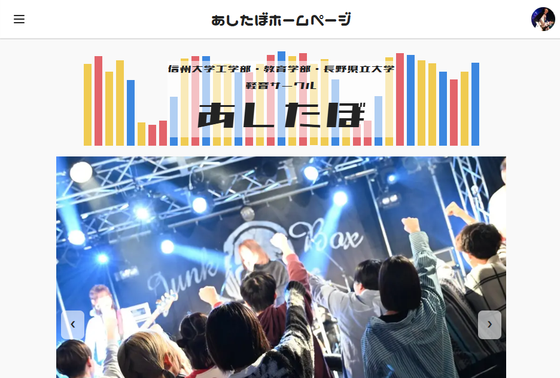
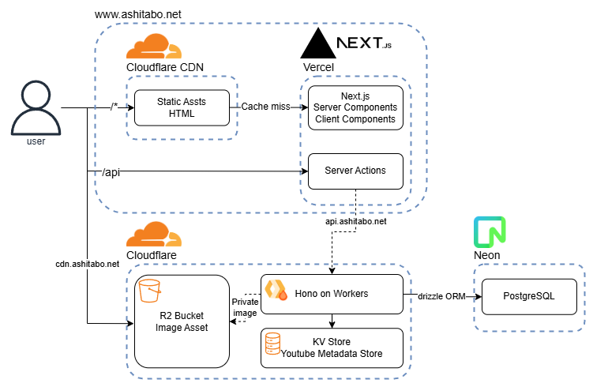

---
layout: two-cols
title: 自己紹介
---

::left::
# 私について

- **名前**: 渡辺 大樹 (わたなべ だいき)
- **所属**: 信州大学工学部 3年生
- **専攻**: 情報工学、通信工学
- **得意領域**: Web全般
- **言語**: TypeScript
- **趣味**: バンド活動、音楽

::right::

---

# スキル

## TypeScript

- **好きなやつ**: React, Next.js, Hono, Astro, Vueなど...
- **成熟度**: ★★★

## その他
- PHP, Python, JavaScript, Ruby, C, C#...
- **成熟度**: ★★

---
layout: two-cols
title: 制作物 - 軽音楽サークルホームページ
---

::left::
## 概要
- 信州大学工学部軽音楽サークル「あしたぼ」の公式サイト
- 過去にあったPHP製アプリ+WordPress製サイトを全面リニューアル
- [あしたぼホームページ](https://www.ashitabo.net/)

::right::

---
layout: two-cols
title: 制作物 - 軽音楽サークルホームページ
---

::left::

## 技術スタック
- [フロントエンド](https://github.com/ashitaboliff/ashitabo_frontend): Next.js 16, Vercel
- バックエンド: Hono, Cloudflare Workers
- データベース: PostgreSQL, Neon
- 認証: Auth.js(LINE OAuth)

::right::

---

# 制作物 - 軽音楽サークルホームページ

## 詳細
- ほとんどを自分で設計・実装
- サークルメンバーからのフィードバックをもとに改善
  - 部員の写真を取得するゲーミフィケーション要素が好評
- 完全無料構成かつ高パフォーマンス
- 月間PV5000程度、広告収益が月数百円
- 今後の維持管理のためのドキュメント整備を実施中

---

# 制作物 - 軽音楽サークルホームページ

## 機能ドメイン
- 学内スタジオの予約管理システム
- YouTubeで非公開アップロードされたライブ映像の検索
- 管理者向けダッシュボード, 部員名簿の管理
- 部員の写真を取得するゲーミフィケーション要素

## 今後の展望
- 日程調整機能、バンド管理機能の追加
- ライブ日程管理、タイムテーブル生成機能の追加

---
layout: two-cols
title: 制作物 - Slidevのテーマ
---

::left::

## 概要
- Slidevのカスタムテーマ「slidev-theme-exam-prep」を開発
- OSSとして公開
- 塾講師として授業で個人的に活用
- [GitHubリポジトリ](https://github.com/watabegg/slidev-exam-prep)

::right::

---

# 制作物 - その他

- **個人サイト**: [watabegg.github.io](https://watabegg.github.io/), Astroを採用
- 一覧は[ポートフォリオサイト](https://watabegg.github.io/product)から

---

# 今後の目標

## 技術の深化
- TypeScriptを中心にさらに深い知識
- Web標準や通信など基礎技術の理解
- OSSへの貢献

## キャリア
- 個人開発を進め、収益増加を目指す
- 生成AIと共存できるエンジニアを目指す

---
layout: end
---
